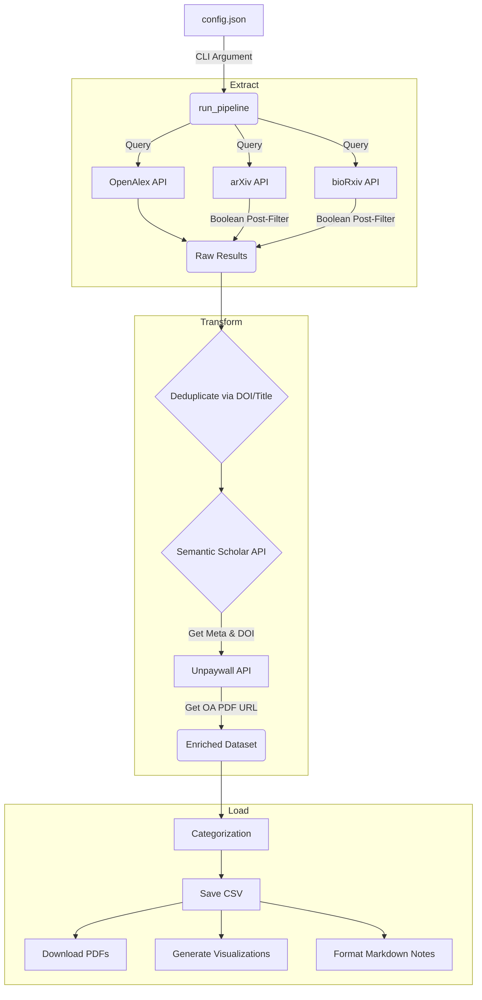

# Scholare Architecture

This document is intended for open-source contributors and developers. It explains the high-level design, data flow, and module responsibilities of the Scholare pipeline.

## System Overview

Scholare is a synchronous, config-driven data pipeline. It is not an ongoing service; it runs a discrete ETL (Extract, Transform, Load) sequence each time it is executed via the CLI.

At a high level, the pipeline follows a 4-stage architecture:
1. **Search (Extract)**: Gather raw paper IDs and titles from multiple search engine APIs.
2. **Deduplicate & Filter**: Clean the raw results to ensure a unique set of papers that strictly match the user's logic.
3. **Enrich (Transform)**: Hydrate the unique papers with deep metadata (abstracts, DOIs) and discover open-access PDF links.
4. **Synthesize & Save (Load)**: Classify the papers, download the PDFs, generate charts, and render a Markdown report.

---

## The Data Flow (Pipeline)

The sequence of operations is orchestrated entirely by `scholare/pipeline.py` -> `run_pipeline()`. 

### 1. Multi-Source Search
Scholare currently aggregates results from three distinct sources (configured via the `sources` array in the JSON config). OpenAlex acts as the primary registry, while arXiv and bioRxiv serve as zero-day preprint catchers.

**Important Note on Preprints:** The arXiv and bioRxiv APIs have notoriously poor native boolean search parsing. To compensate, Scholare retrieves a broad text match from them and then runs a strict local Python boolean evaluation (`utils.check_boolean_query`) against the returned abstracts before allowing them into the pipeline.

### 2. Deduplication
Because a single paper might exist on bioRxiv, OpenAlex, and Semantic Scholar simultaneously, results are passed through `utils.deduplicate_papers()`. It relies primarily on the DOI. If a DOI is missing, it falls back to a normalized string comparison of the title.

### 3. Metadata Enrichment
Every unique paper is passed to the Semantic Scholar Graph API (`api.get_paper_metadata()`).
- Scholare prioritizes searching S2 via the **DOI** (if found during the Extract phase).
- It falls back to a **Title** search if no DOI exists.
- The pipeline extracts the Abstract, TLDR, and Citation count.

### 4. Open-Access Discovery
Scholare uses a cascading fallback mechanism to find legal, free PDF links:
1. **Primary Check**: Did OpenAlex or arXiv provide a direct open-access URL?
2. **Secondary Check**: Did Semantic Scholar provide an `openAccessPdf` object?
3. **Tertiary Fallback**: If both failed but a DOI is present, ping the Unpaywall API (`api.get_unpaywall_pdf()`).

---

## Module Responsibilities

The codebase is organized into highly distinct modules to make contributing easy.

| File | Responsibility |
|------|----------------|
| `__main__.py` | CLI entry point. Parses arguments (`--config`, `--no-download`) and triggers the pipeline. |
| `config.py` | Validates the user's JSON configuration and loads API keys dynamically from `.env` or system variables. |
| `pipeline.py` | Injects the config and orchestrates the ETL flow. Builds the master Pandas DataFrame. |
| `api.py` | Contains all network/HTTP logic. Handles exponential backoff, rate limits, and API specific data parsing for OpenAlex, Semantic Scholar, Unpaywall, arXiv, and Crossref (bioRxiv). |
| `utils.py` | Pure, stateless helper functions. Contains the boolean query evaluator, categorization classification, deduplication logic, and filename sanitization. |
| `downloader.py` | Iterates over the final DataFrame and uses the `requests` library to stream and save PDFs locally. |
| `notes.py` | Formats the highly structured Markdown output report (`research_notes.md`), embedding the visualizations and TLDRs. |
| `visualizations.py`| Uses Matplotlib and Seaborn to generate statistical charts based on the final DataFrame. |

---

## Adding New APIs

To add a new search engine to Scholare (e.g., PubMed, CORE):
1. **Add the Client**: Create a `search_{engine}` function in `api.py`.
2. **Standardize Output**: Ensure the function maps its response to the standard dict format expected by the pipeline (`title`, `publication_info`, `_openalex_doi`, etc.).
3. **Inject to Pipeline**: Add the engine to the `sources` execution loop in `pipeline.py` (`[1/X] Querying...`).
4. **Update Defaults**: Add the engine string to the default `sources` list in `config.py` and `config_example.json`.
