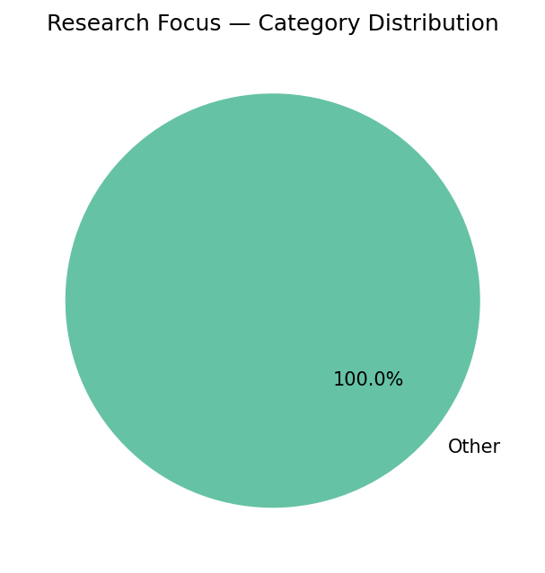
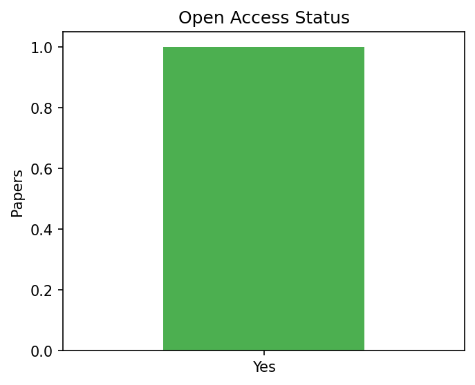
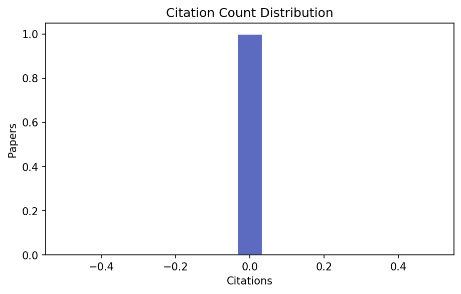
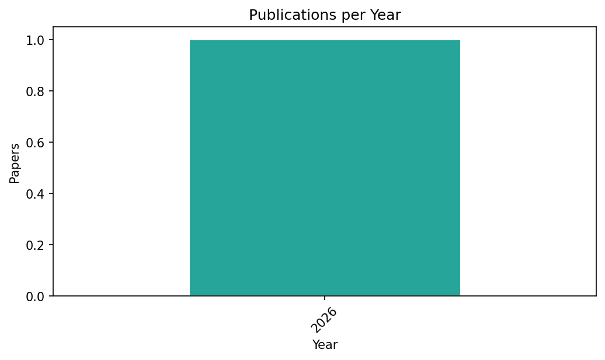

# Research Notes

> **Query:** `EEG AND bias AND electrode`  
> **Generated:** 2026-03-06 09:34:22  
> **Total papers:** 1

---

## 1. Executive Summary

| Metric | Value |
|--------|-------|
| Open-access papers | 1 / 1 (100.0%) |
| Papers with code hints | 0 |
| Papers with data hints | 0 |

## 2. Taxonomy — Category Distribution

| Category | Count | % |
|----------|------:|--:|
| Other | 1 | 100.0% |

## 3. Top Cited Papers

| # | Title | Year | Citations | Category | Link |
|--:|-------|------|----------:|----------|------|
| 1 | Task-Related EEG Spectral Power (Theta and Beta Bands) During Visual Memory Performance Under Different Levels of Perceived Stress | 2026 | 0 | Other | [link](10.5281/zenodo.18863759) |

## 4. Key Findings by Category

### Other

- **Task-Related EEG Spectral Power (Theta and Beta Bands) During Visual Memory Performance Under Different Levels of Perceived Stress** (2026, 0 citations)
  - Open Access: Yes · Code: N/A · Data: N/A
  - DOI: `10.5281/zenodo.18863759`
  - [Link](10.5281/zenodo.18863759)

## 5. Visual Summary

### Category Distribution

### Open Access Status

### Citation Distribution

### Year Distribution

## 6. Full Paper Index

| # | Title | Year | Citations | Category | OpenAccess | HasCode | HasData | Link |
|--:|---|---|---|---|---|---|---|---|
| 1 | Task-Related EEG Spectral Power (Theta and Beta Bands) During Visual Memory Performance Under Different Levels of Perceived Stress | 2026 | 0 | Other | Yes | N/A | N/A | [link](10.5281/zenodo.18863759) |
