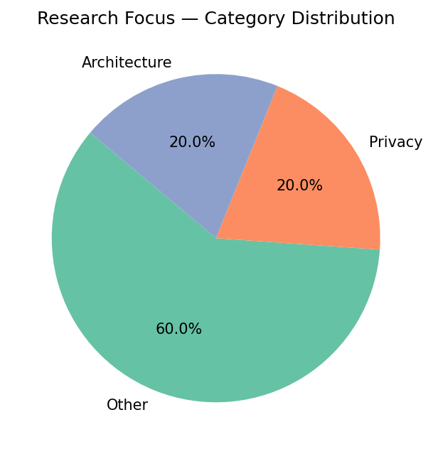
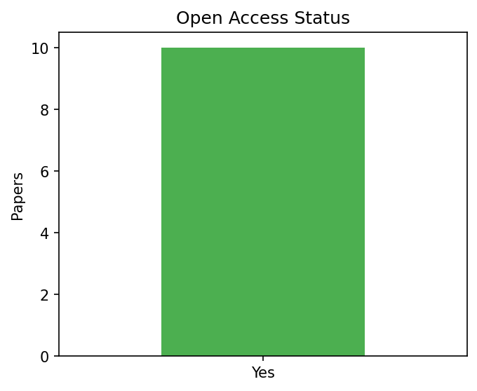
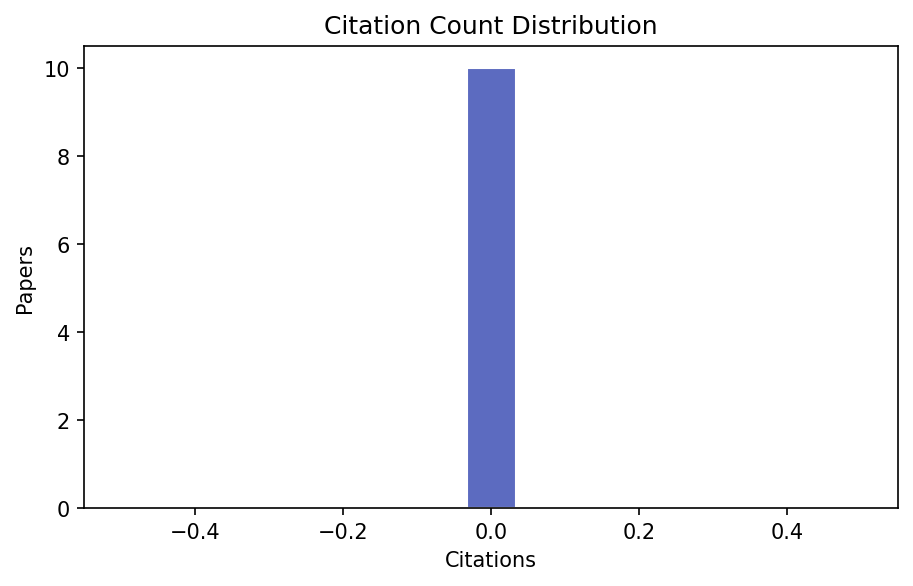
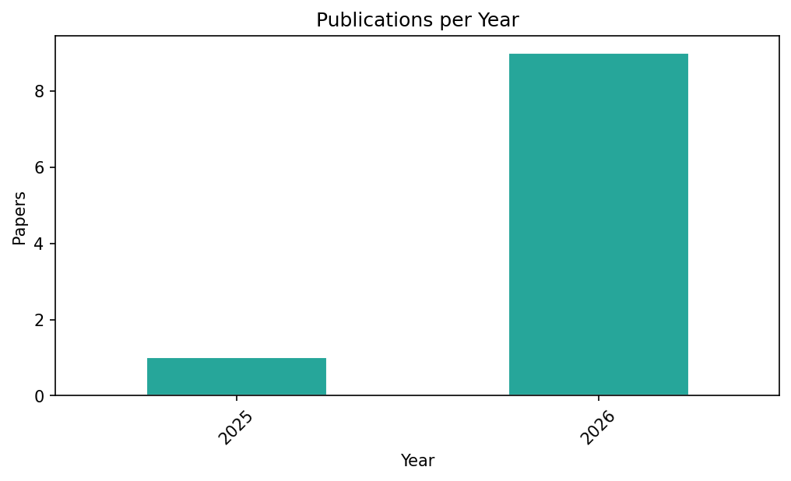

# Research Notes

> **Query:** `federated learning AND differential privacy`  
> **Generated:** 2026-03-04 14:05:51  
> **Total papers:** 10

---

## 1. Executive Summary

| Metric | Value |
|--------|-------|
| Open-access papers | 10 / 10 (100.0%) |
| Papers with code hints | 1 |
| Papers with data hints | 0 |

## 2. Taxonomy — Category Distribution

| Category | Count | % |
|----------|------:|--:|
| Other | 6 | 60.0% |
| Privacy | 2 | 20.0% |
| Architecture | 2 | 20.0% |

## 3. Top Cited Papers

| # | Title | Year | Citations | Category | Link |
|--:|-------|------|----------:|----------|------|
| 1 | FedSMOTE-DP: Privacy-Aware Federated Ensemble Learning for Intrusion Detection in IoMT Networks | 2026 | 0 | Privacy | [link](10.3390/s26051592) |
| 2 | Accurate, private, secure, federated U-statistics with higher degree | 2026 | 0 | Privacy | [link](nan) |
| 3 | [arXiv] CFG-Ctrl: Control-Based Classifier-Free Diffusion Guidance | 2026 | 0 | Other | [link](http://arxiv.org/abs/2603.03281v1) |
| 4 | Adaptive Neural Network Method for Detecting Crimes in the Digital Environment to Ensure Human Rights and Support Forensic Investigations | 2026 | 0 | Other | [link](10.3390/data11030049) |
| 5 | PAI Oncology Trial FL: Federated Machine Learning Framework for Physical AI Oncology Trials | 2026 | 0 | Other | [link](10.5281/zenodo.18840954) |
| 6 | [arXiv] Utonia: Toward One Encoder for All Point Clouds | 2026 | 0 | Architecture | [link](http://arxiv.org/abs/2603.03283v1) |
| 7 | [arXiv] ULTRA: Unified Multimodal Control for Autonomous Humanoid Whole-Body Loco-Manipulation | 2026 | 0 | Other | [link](http://arxiv.org/abs/2603.03279v1) |
| 8 | [arXiv] How to Peel with a Knife: Aligning Fine-Grained Manipulation with Human Preference | 2026 | 0 | Other | [link](http://arxiv.org/abs/2603.03280v1) |
| 9 | [arXiv] Tether: Autonomous Functional Play with Correspondence-Driven Trajectory Warping | 2026 | 0 | Other | [link](http://arxiv.org/abs/2603.03278v1) |
| 10 | Federated Learning for Dynamic Resource Allocation in 6G Network Slicing | 2025 | 0 | Architecture | [link](10.1007/s11277-026-11943-3) |

## 4. Key Findings by Category

### Privacy

- **FedSMOTE-DP: Privacy-Aware Federated Ensemble Learning for Intrusion Detection in IoMT Networks** (2026, 0 citations)
  - Open Access: Yes · Code: N/A · Data: N/A
  - DOI: `10.3390/s26051592`
  - [Link](10.3390/s26051592)

- **Accurate, private, secure, federated U-statistics with higher degree** (2026, 0 citations)
  > This work proposes a protocol that securely computes U-statistics of degree k $\ge$ 2 under central differential privacy by leveraging Multi Party Computation (MPC), and substantially improves accuracy when compared to prior solutions.
  - Open Access: Yes · Code: No · Data: No
  - DOI: `nan`
  - [Link](nan)

### Other

- **[arXiv] CFG-Ctrl: Control-Based Classifier-Free Diffusion Guidance** (2026, 0 citations)
  > This paper explores a unified framework called CFG-Ctrl, which reinterprets CFG as a control applied to the first-order continuous-time generative flow, using the conditional-unconditional discrepancy as an error signal to adjust the velocity field.
  - Open Access: Yes · Code: YES · Data: No
  - [Link](http://arxiv.org/abs/2603.03281v1)

- **Adaptive Neural Network Method for Detecting Crimes in the Digital Environment to Ensure Human Rights and Support Forensic Investigations** (2026, 0 citations)
  - Open Access: Yes · Code: N/A · Data: N/A
  - DOI: `10.3390/data11030049`
  - [Link](10.3390/data11030049)

- **PAI Oncology Trial FL: Federated Machine Learning Framework for Physical AI Oncology Trials** (2026, 0 citations)
  - Open Access: Yes · Code: N/A · Data: N/A
  - DOI: `10.5281/zenodo.18840954`
  - [Link](10.5281/zenodo.18840954)

- **[arXiv] ULTRA: Unified Multimodal Control for Autonomous Humanoid Whole-Body Loco-Manipulation** (2026, 0 citations)
  > Results show that ULTRA generalizes to autonomous, goal-conditioned whole-body loco-manipulation from egocentric perception, consistently outperforming tracking-only baselines with limited skills.
  - Open Access: Yes · Code: No · Data: No
  - [Link](http://arxiv.org/abs/2603.03279v1)

- **[arXiv] How to Peel with a Knife: Aligning Fine-Grained Manipulation with Human Preference** (2026, 0 citations)
  - Open Access: Yes · Code: N/A · Data: N/A
  - [Link](http://arxiv.org/abs/2603.03280v1)

- **[arXiv] Tether: Autonomous Functional Play with Correspondence-Driven Trajectory Warping** (2026, 0 citations)
  - Open Access: Yes · Code: N/A · Data: N/A
  - [Link](http://arxiv.org/abs/2603.03278v1)

### Architecture

- **[arXiv] Utonia: Toward One Encoder for All Point Clouds** (2026, 0 citations)
  - Open Access: Yes · Code: N/A · Data: N/A
  - [Link](http://arxiv.org/abs/2603.03283v1)

- **Federated Learning for Dynamic Resource Allocation in 6G Network Slicing** (2025, 0 citations)
  > A Federated Deep Reinforcement Learning (FDRL) framework for dynamic radio and edge computing resource allocation and slicing management in O-RAN environments that leverages Federated Learning to optimize performance while preserving data privacy and reducing communication overhead is presented.
  - Open Access: Yes · Code: No · Data: No
  - DOI: `10.3390/fi17030106`
  - [Link](10.1007/s11277-026-11943-3)

## 5. Visual Summary

### Category Distribution

### Open Access Status

### Citation Distribution

### Year Distribution

## 6. Full Paper Index

| # | Title | Year | Citations | Category | OpenAccess | HasCode | HasData | Link |
|--:|---|---|---|---|---|---|---|---|
| 1 | FedSMOTE-DP: Privacy-Aware Federated Ensemble Learning for Intrusion Detection in IoMT Networks | 2026 | 0 | Privacy | Yes | N/A | N/A | [link](10.3390/s26051592) |
| 2 | Accurate, private, secure, federated U-statistics with higher degree | 2026 | 0 | Privacy | Yes | No | No | [link](nan) |
| 3 | [arXiv] CFG-Ctrl: Control-Based Classifier-Free Diffusion Guidance | 2026 | 0 | Other | Yes | YES | No | [link](http://arxiv.org/abs/2603.03281v1) |
| 4 | Adaptive Neural Network Method for Detecting Crimes in the Digital Environment to Ensure Human Rights and Support Forensic Investigations | 2026 | 0 | Other | Yes | N/A | N/A | [link](10.3390/data11030049) |
| 5 | PAI Oncology Trial FL: Federated Machine Learning Framework for Physical AI Oncology Trials | 2026 | 0 | Other | Yes | N/A | N/A | [link](10.5281/zenodo.18840954) |
| 6 | [arXiv] Utonia: Toward One Encoder for All Point Clouds | 2026 | 0 | Architecture | Yes | N/A | N/A | [link](http://arxiv.org/abs/2603.03283v1) |
| 7 | [arXiv] ULTRA: Unified Multimodal Control for Autonomous Humanoid Whole-Body Loco-Manipulation | 2026 | 0 | Other | Yes | No | No | [link](http://arxiv.org/abs/2603.03279v1) |
| 8 | [arXiv] How to Peel with a Knife: Aligning Fine-Grained Manipulation with Human Preference | 2026 | 0 | Other | Yes | N/A | N/A | [link](http://arxiv.org/abs/2603.03280v1) |
| 9 | [arXiv] Tether: Autonomous Functional Play with Correspondence-Driven Trajectory Warping | 2026 | 0 | Other | Yes | N/A | N/A | [link](http://arxiv.org/abs/2603.03278v1) |
| 10 | Federated Learning for Dynamic Resource Allocation in 6G Network Slicing | 2025 | 0 | Architecture | Yes | No | No | [link](10.1007/s11277-026-11943-3) |
